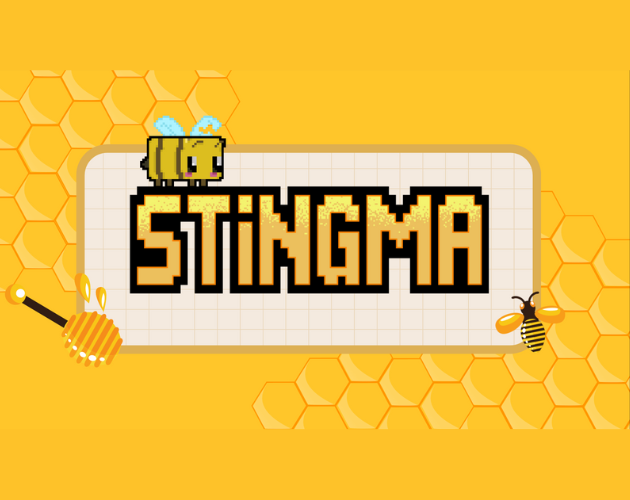

    <h1 align="center">
        Hi, My name is Ramon Rios (Reisel_Rol_7) 👋
    <h1>

## About Me

- 👨‍💻 Fullstack MERN developer.
- 🏆 Winner of [Valles Game Jam 2024](https://itch.io/jam/valles-game-jam-2024).
- 🥇 First place in the [inVideogames Jam](https://delaguila.itch.io/stingma) in Spain.
- 🥈 Second place in the [inVideogames Jam](https://delaguila.itch.io/stingma) in Europe.
- 🎮 In my free time, I program 2D video games using Gamemaker Studio 2 and Unity.
- 💡 Constantly learning more every day.
- 🚀 I enjoy challenges.

## Game Jams Proyects

<table>
    <tr>
        <td width="50%">
            <h3 align="center">
                Stingma
            </h3>
        </td>
        <td width="50%">
            <h3 align="center">
                Under Judgement
            </h3>
        </td>
    </tr>
    <tr>
        <td width="50%">
            
        </td>
        <td width="50%">
            
        </td>
    </tr>
    <tr>
        <td width="50%">
            
            
        </td>
        <td width="50%">
            
            
        </td>
    </tr>
    <tr>
        <td width="50%">
            Positions:
            <ul>
                <li>🥇 Spain</li>
                <li>🥈 Europe</li>
            </ul>
        </td>
        <td width="50%">
            Positions:
            <ul>
                <li>🥇 Spain, Catalonia</li>
            </ul>
        </td>
    </tr>
</table>

### ⚙️ &nbsp;GitHub Analytics

    
    
    

